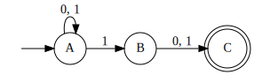
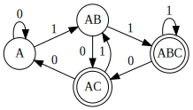

# Finite State Automata

A small project demonstrating both deterministic and nondeterministic finite
state machines.

Two classes, `dfa.DFA` and `nfa.NFA` are provided.
Both have an `accepts` method whose parameters are the symbols a word.

An `EPSILON` singleton is included in python-fsa. The `EPSILON` singleton
provides the epsilon symbol, ε, with `EPSILON.symbol`; this symbol is also
returned from the `EPSILON.__str__` method.

To convert an `NFA` to a `DFA`, call the `to_dfa` method on an `NFA` instance.

## Dot file parsing

Dot files can be parsed into FSMs provided they satisfy the following
conditions:

- Has one node with the name "null" with a single edge to the initial state this
  can be made to be invisible by
  prepending `null [label=" ",shape=none,height=0,width=0];` to your
  graph. (optionally, add `{null rank="min"};` as well to force this edge to
  appear on the left)
- Final states have shape "doublecircle"
- Multiple transitions using the same edge must separate alphabet symbols by
  commas.

## Examples

### DFA Example

Consider the following DFA that recognises the language of words over the
alphabet {0, 1} which contain an even number of 1s


A DFA instance can be constructed:

```python
from python_fsa import DFA

a, b = "a", "b"

dfa = DFA(
    alphabet=frozenset((0, 1)),
    states=frozenset((a, b)),
    initial=a,
    transition={
        (a, 0): a,
        (a, 1): b,
        (b, 0): b,
        (b, 1): a,
    },
    final_states=frozenset((a,))
)
```

Words can then be accepted or rejected by calling `accepts`:

```python
dfa.accepts(0, 0, 0, 1)  # True
dfa.accepts(0, 1, 1, 0)  # False
```

### NFA Example

Consider the following NFA that recognises the language of words over the
alphabet {0, 1} whose second to last symbol is 1.



An NFA instance can be constructed:

```python
from python_fsa import NFA

a, b, c = "a", "b", "c"

nfa = NFA(
    alphabet=frozenset((1, 0)),
    states=frozenset((a, b, c)),
    initial=a,
    transition={
        (a, 0): frozenset((a,)),
        (a, 1): frozenset((a, b)),
        (b, 0): frozenset((c,)),
        (b, 1): frozenset((c,)),
    },
    final_states=frozenset((c,)),
)
```

Words can then be accepted or rejected by calling `accepts`:

```python
nfa.accepts(0, 1, 1, 0)  # True
nfa.accepts(0, 0, 0, 1)  # False
```

This NFA can be converted to an equivalent DFA by calling `to_dfa`:

```python
dfa = nfa.to_dfa()
```

Which produces the following DFA:



### Parsing From Dot Graphs

FSAs can be parsed from strings representing AGraphs in dot format by calling
the `from_dot` class method on the `DFA` or `NFA` classes.
For example:

```python
dot = r"""
digraph {
    rankdir = LR;
    null [label = " ",shape = none,height = 0,width = 0];
    {null rank = "min"};
    node [shape = doublecircle]; C;
    node [shape = circle];
    null -> A;
    A -> A [label = "0, 1"];
    A -> B [label = "1"];
    B -> C [label = "0, 1"];
}
"""

nfa = NFA.from_dot(dot)
```

## Install Notes

Python-fsa depends on graphviz and pygraphviz.
There seem to be some global options that are needed to install pygraphviz.
I have only tested this on MacOS and have found the following commands to work:

```
brew install graphviz
pip install \
    --global-option=build_ext \
    --global-option="-I/opt/homebrew/Cellar/graphviz/7.0.0/include/" \
    --global-option="-L/opt/homebrew/Cellar/graphviz/7.0.0/lib" \
    pygraphviz
pip install python-fsa
```

Replace the `7.0.0` version number with the current version of graphviz.
See [this comment](https://github.com/pypa/setuptools/issues/2740#issuecomment-1087875770)
for more.
