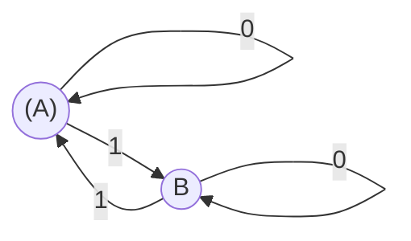
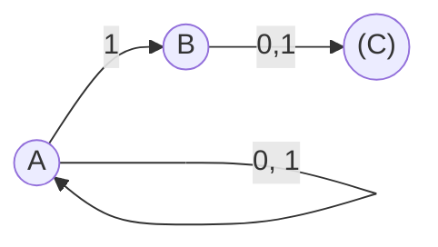

# Finite State Automata

A small project demonstrating both deterministic and nondeterministic finite
state machines.

Two classes, `dfa.DFA` and `nfa.NFA` are provided.
Both have an `accepts` method whose parameters are the symbols a word.

The `NFA` class also has an epsilon object `NFA.epsilon`.
However, a custom epsilon object can be passed into the constructor as a named
argument.

## DFA Example

Consider the following DFA that recognises the language of words over the
alphabet {0, 1} which contain an even number of 1s



A DFA instance can be constructed:

```python
from dfa import DFA

a, b = "a", "b"

dfa = DFA(
    alphabet=frozenset((0, 1)),
    states=frozenset((a, b)),
    initial=a,
    transition={
        (a, 0): a,
        (a, 1): b,
        (b, 0): b,
        (b, 1): a,
    },
    final_states=frozenset((a,))
)
```

Words can then be accepted or rejected by calling `accepts`:

```python
dfa.accepts(0, 0, 0, 1)  # True
dfa.accepts(0, 1, 1, 0)  # False
```

## NFA Example

Consider the following NFA that recognises the language of words over the
alphabet {0, 1} whose second to last symbol is 1.



An NFA instance can be constructed:

```python
from nfa import NFA

a, b, c = "a", "b", "c"

nfa = NFA(
    alphabet=frozenset((1, 0)),
    states=frozenset((a, b, c)),
    initial=a,
    transition={
        (a, 0): frozenset((a,)),
        (a, 1): frozenset((a, b)),
        (b, 0): frozenset((c,)),
        (b, 1): frozenset((c,)),
    },
    final_states=frozenset((c,)),
)
```

Words can then be accepted or rejected by calling `accepts`:

```python
nfa.accepts(0, 1, 1, 0)  # True
nfa.accepts(0, 0, 0, 1)  # False
```

