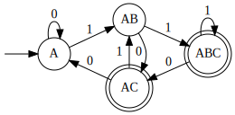

# Finite State Automata

A small project demonstrating both deterministic and nondeterministic finite
state machines.


## Docs

https://python-fsa.rtfd.io/

## Install

```
pip install python-fsa
```

<details>
<summary>Installation Notes</summary>

Python-fsa depends on graphviz and pygraphviz.
There seem to be some global options that are needed to install pygraphviz.
I have only tested this on macOS and have found the following commands to work:

```
brew install graphviz
pip install \
    --global-option=build_ext \
    --global-option="-I/opt/homebrew/Cellar/graphviz/8.0.5/include/" \
    --global-option="-L/opt/homebrew/Cellar/graphviz/8.0.5/lib" \
    pygraphviz
pip install python-fsa
```

Replace the `8.0.5` version number with the current version of graphviz.
See [this comment](https://github.com/pypa/setuptools/issues/2740#issuecomment-1087875770)
for more.

</details>

## Examples

### DFA Example

Consider the following DFA that recognises the language of words over the
alphabet {0, 1} which contain an even number of 1s


A DFA instance can be constructed:

```python
from python_fsa.dfa import DFA

a, b = "a", "b"

dfa = DFA(
    alphabet=frozenset((0, 1)),
    states=frozenset((a, b)),
    initial=a,
    transitions={
        (a, 0): a,
        (a, 1): b,
        (b, 0): b,
        (b, 1): a,
    },
    final=frozenset((a,)),
)
```

Words can then be accepted or rejected by calling `accepts`:

```python
dfa.accepts((0, 0, 0, 1))  # False
dfa.accepts((0, 1, 1, 0))  # True
```

Words can be given one at a time to a mutable transducer of the DFA:

```python
dfa_transducer = dfa.transducer()

dfa_transducer.push(1)  # False
dfa_transducer.push(0)  # False
dfa_transducer.push(1)  # True
dfa_transducer.push(0)  # True
```

### NFA Example

Consider the following NFA that recognises the language of words over the
alphabet {0, 1} whose second to last symbol is 1.


An NFA instance can be constructed:

```python
from python_fsa.nfa import NFA

a, b, c = "a", "b", "c"

nfa = NFA(
    alphabet=frozenset((1, 0)),
    states=frozenset((a, b, c)),
    initial=a,
    transitions={
        (a, 0): frozenset((a,)),
        (a, 1): frozenset((a, b)),
        (b, 0): frozenset((c,)),
        (b, 1): frozenset((c,)),
    },
    final=frozenset((c,)),
)
```

Words can then be accepted or rejected by calling `accepts`:

```python
nfa.accepts((0, 1, 1, 0))  # True
nfa.accepts((0, 0, 0, 1))  # False
```

This NFA can be converted to an equivalent DFA by calling `to_dfa`:

```python
dfa = nfa.to_dfa()
```

However, this will result in a DFA of type `DFA[T, frozenset[S]]` – as the
states of the resulting DFA are from the powerset of NFA states. This can cause
errors in writing the resulting DFA to dot-format.

The `frozenset[S]` states can be squashed to strings by calling `dfa.squash()`,
which stringifies and joins states in each `frozenset[S]`:

```python
dfa = nfa.to_dfa().squash()
```

Which produces the following DFA:


