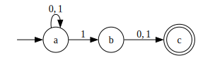

Examples
========

DFAs
----

Example 1
^^^^^^^^^

Recognises the language of words over the alphabet {0, .., 9}
which are divisible by 5 (end in 0 or 5 or are empty)

Taken from: https://www.bookofproofs.org/branches/examples-of-dfa/

::

    from python_fsa.dfa import DFA

    a, b = "a", "b"

    dfa = DFA(
        alphabet=(1, 2, 3, 4, 5, 6, 7, 8, 9, 0),
        states=(a, b),
        initial=a,
        transitions={
            (a, 0): a, (a, 1): b, (a, 2): b, (a, 3): b, (a, 4): b, (a, 5): a,
            (a, 6): b, (a, 7): b, (a, 8): b, (a, 9): b,
            (b, 0): a, (b, 1): b, (b, 2): b, (b, 3): b, (b, 4): b, (b, 5): a,
            (b, 6): b, (b, 7): b, (b, 8): b, (b, 9): b,
        },
        final=(a,),
    )

   ``render(dfa, "assets/dfa_example1.svg")``

Example 2
^^^^^^^^^

Recognises the language of words over the alphabet {0, 1}
which contain exactly two 1s

Taken from: https://www.bookofproofs.org/branches/examples-of-dfa/

::

    from python_fsa.dfa import DFA

    a, b, c, d = "a", "b", "c", "d"

    dfa = DFA(
        alphabet=frozenset((0, 1)),
        states=frozenset((a, b, c, d)),
        initial=a,
        transitions={
            (a, 0): a,
            (a, 1): b,
            (b, 0): b,
            (b, 1): c,
            (c, 0): c,
            (c, 1): d,
            (d, 0): d,
            (d, 1): d,
        },
        final=frozenset((c,))
    )

.. figure:: assets/dfa_example2.svg
   :alt: A chain of four nodes, the first is the initial and the third is the final state. Each node has a transition to itself with the word "0", and a transition to the next node with the word "1", except the last where both 0 and one transition to itself.

   ``render(dfa, "assets/dfa_example2.svg")``

Example 3
^^^^^^^^^

Recognises the language of words over the alphabet {0, 1}
which contain an even number of 1s

Taken from: https://www.bookofproofs.org/branches/examples-of-dfa/

::

    from python_fsa.dfa import DFA

    a, b = "a", "b"

    dfa = DFA(
        alphabet=(0, 1),
        states=(a, b),
        initial=a,
        transitions={(a, 0): a, (a, 1): b, (b, 0): b, (b, 1): a},
        final=(a,),
    )

.. figure:: assets/dfa_example3.svg
   :alt: Two nodes, the first is the initial and final state. both nodes transition to each other with the word "1" and transition to themselves with the word "0"

   ``render(dfa, "assets/dfa_example3.svg")``

NFAs
----

Example 1
^^^^^^^^^

Recognises the language of words over the alphabet {0, 1}
which consist of an even number of 1s or 0s

Taken from: https://en.wikipedia.org/wiki/Nondeterministic_finite_automaton#Example_2

::

    from python_fsa.nfa import NFA

    s0, s1, s2, s3, s4 = "s0", "s1", "s2", "s3", "s4"
    E = NFA.EPSILON

    nfa = NFA(
        alphabet=(1, 0),
        states=(s0, s1, s2, s3, s4),
        initial=s0,
        transitions={
            (s0, E): (s1, s3),
            (s1, 0): (s2,),
            (s1, 1): (s1,),
            (s2, 0): (s1,),
            (s2, 1): (s2,),
            (s3, 0): (s3,),
            (s3, 1): (s4,),
            (s4, 0): (s4,),
            (s4, 1): (s3,),
        },
        final=(s1, s3,),
    )

   ``render(nfa, "assets/nfa_example1.svg")``

Example 2
^^^^^^^^^

Recognises the language of words over the alphabet {0, 1}
whose second to last symbol is 1.

Taken from: https://www.bookofproofs.org/branches/examples-of-nfa/

::

    from python_fsa.nfa import NFA

    a, b, c = "a", "b", "c"

    nfa = NFA(
        alphabet=(1, 0),
        states=(a, b, c),
        initial=a,
        transitions={
            (a, 0): (a,),
            (a, 1): (a, b),
            (b, 0): (c,),
            (b, 1): (c,),
        },
        final=(c,),
    )

   ``render(nfa, "assets/nfa_example2.svg")``

Example 3
^^^^^^^^^

Recognises the language of words over the alphabet {0, 1}
which are any combinations of the strings 10 and 101

Taken from: https://www.bookofproofs.org/branches/examples-of-nfa/

::

    from python_fsa.nfa import NFA

    a, b, c = "a", "b", "c"

    nfa = NFA(
        alphabet=(1, 0),
        states=(a, b, c),
        initial=a,
        transitions={
            (a, 1): (b,),
            (b, 0): (a, c),
            (c, 1): (a,),
        },
        final=(a,),
    )

   ``render(nfa, "assets/nfa_example3.svg")``
