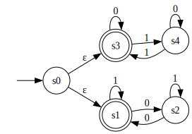

Quick Start
===========

Install
-------

::

    pip install python-fsa

Installation Notes
^^^^^^^^^^^^^^^^^^

In order to use the python-fsa :func:`~python_fsa.graph.render`,
:func:`~python_fsa.graph.dfa_from_dot`, and
:func:`~python_fsa.graph.nfa_from_dot` functions, pygraphviz will need to be
installed.

See the `PyGraphviz FAQ
<https://pygraphviz.github.io/documentation/stable/reference/faq.html>`_
for more information on how to install this.

For macOS, the path to Graphviz needs to be specified when installing.
For example, if brew installing graphviz:

::

    brew install graphviz
    pip install \
        --global-option=build_ext \
        --global-option="-I/opt/homebrew/Cellar/graphviz/8.1.0/include/" \
        --global-option="-L/opt/homebrew/Cellar/graphviz/8.1.0/lib" \
        pygraphviz
    pip install python-fsa

Replace the version ``8.1.0`` with your current version of Graphviz.

This is not needed if the aforementioned functions are not needed.

Usage
-----

The two main classes in python-fsa are :class:`~python_fsa.dfa.DFA` and
:class:`~python_fsa.nfa.NFA` which provide immutable deterministic and
non-deterministic finite state automata respectively.

Each takes an alphabet, states, initial state, transition mapping, and final
state. For example, the following dfa recognises the language of words over the
alphabet {0, 1} which contain an even number of 1s:

::

    from python_fsa.dfa import DFA

    a, b = "a", "b"

    dfa = DFA(
        alphabet=(0, 1),
        states=(a, b),
        initial=a,
        transitions={(a, 0): a, (a, 1): b, (b, 0): b, (b, 1): a},
        final=(a,),
    )

    dfa.accepts((1, 0, 1, 0))  # True
    dfa.accepts((1, 1, 1, 0))  # False

Taken from: https://www.bookofproofs.org/branches/examples-of-dfa/

The following NFA recognises the language of words over the alphabet {0, 1}
which consist of an even number of 1s or 0s:

::

    from python_fsa.nfa import NFA

    s0, s1, s2, s3, s4 = "s0", "s1", "s2", "s3", "s4"
    E = NFA.EPSILON

    nfa = NFA(
        alphabet=(1, 0),
        states=(s0, s1, s2, s3, s4),
        initial=s0,
        transitions={
            (s0, E): (s1, s3),
            (s1, 0): (s2,),
            (s1, 1): (s1,),
            (s2, 0): (s1,),
            (s2, 1): (s2,),
            (s3, 0): (s3,),
            (s3, 1): (s4,),
            (s4, 0): (s4,),
            (s4, 1): (s3,),
        },
        final=(s1, s3),
    )

    nfa.accepts((1, 0, 1))  # True
    nfa.accepts((1, 0))  # False

Taken from: https://en.wikipedia.org/wiki/Nondeterministic_finite_automaton#Example_2

This NFA features an epsilon transition. By default, the
:attr:`~python_fsa.nfa.NFA.EPSILON` constant is used. If a different object is
wanted for this purpose, epsilon will need to be passed in as a named parameter
in the NFA constructor. Epsilons are compared via equality when NFAs are
constructed so should define ``__eq__`` or be singletons.

Processing NFAs
^^^^^^^^^^^^^^^

Epsilon edges can be removed with :meth:`~python_fsa.nfa.NFA.without_epsilon`.
For example:

::

    new_nfa = nfa.without_epsilon()

NFAs can be converted to DFAs with the :meth:`~python_fsa.nfa.NFA.to_dfa`
method. For example:

::

    new_dfa = nfa.to_dfa()

It is often useful to then :meth:`~python_fsa.dfa.DFA.squash` the resulting DFA
which converts the sets of states resulting from the transformation to strings.
For example:

::

    new_dfa = nfa.to_dfa().squash()

Now instead of being of type ``DFA[int, frozenset[str]]``, the dfa is of type
``DFA[int, str]`` which is often more useful when displaying the resulting DFA.

FSAs and Graphviz
^^^^^^^^^^^^^^^^^

The :mod:`~python_fsa.graph` module has many utility functions for turning FSA
to and from graphviz dot language, and rendering FSAs as images.

For Example, using the FSAs from before:

::

    from python_fsa.graph import dfa_from_dot, nfa_from_dot, render, to_dot

    # FSA to Graphviz dot code
    nfa_dot = to_dot(nfa)
    dfa_dot = to_dot(dfa)

    # Graphviz dot code to FSA
    new_nfa = nfa_from_dot(nfa_dot)
    new_dfa = dfa_from_dot(dfa_dot)

    # Render FSA as Graphviz diagram
    render(nfa, "assets/nfa_example.svg")
    render(dfa, "assets/dfa_example.svg")

With the last two commands producing the following images:

   A DFA

   An NFA

Transducers
^^^^^^^^^^^

NFAs and DFAs are immutable, only able to accept or reject an entire
string of words. However, FSAs can produce mutable transducers which can take
a single word at a time. These transducers are Moore machines that can
optionally provide output for each state the transducer is in.

NFAs and DFAs produce :class:`python_fsa.nfa.NFATransducer` and
:class:`python_fsa.dfa.DFATransducer` objects respectively and are created with
the :meth:`python_fsa.nfa.NFA.transducer` and
:meth:`python_fsa.dfa.DFA.transducer` methods respectively.

For example:

::

    output = {a: "Even #ones", b: "Odd #ones"}
    dfa_transducer = dfa.transducer(output)

    dfa_transducer.push(1)  # Odd #ones
    dfa_transducer.push(0)  # Odd #ones
    dfa_transducer.push(1)  # Even #ones
    dfa_transducer.push(0)  # Even #ones
    dfa_transducer.current  # 'a'
    dfa_transducer.is_accepting  # True
    dfa_transducer.output  # Even #ones

If no output mapping is given, the default is to return a boolean indicating
whether the current state is a final state.

NFAs, will return sets of outputs:

::

    output = {
        s0: "Both Even",
        s1: "Even #Zeros",
        s2: "Odd #Zeros",
        s3: "Even #Ones",
        s4: "Odd #Ones",
    }
    nfa_transducer = nfa.transducer(output)

    nfa_transducer.push(1)  # frozenset({'Odd #Ones', 'Even #Zeros'})
    nfa_transducer.push(0)  # frozenset({'Odd #Ones', 'Odd #Zeros'})
    nfa_transducer.push(1)  # frozenset({'Even #Ones', 'Odd #Zeros'})
    nfa_transducer.push(0)  # frozenset({'Even #Ones', 'Even #Zeros'})
    nfa_transducer.current  # frozenset({'s1', 's3'})
    nfa_transducer.is_accepting  # True
    nfa_transducer.output  # frozenset({'Even #Ones', 'Even #Zeros'})
